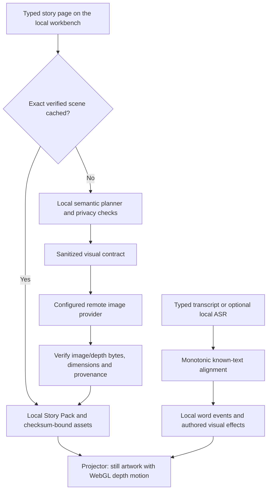

# Bookforge system audit

September 5, 2026, against repository `e71f0b8`. This review reconciles implementation, recorded
experiments and a fresh read-only Jetson check. It makes no new inference, visual-accuracy,
cloud-availability or physical-display measurement. Historical measurements below retain their
original hardware, prompt, sample and timing boundaries.

## Product assessment

Bookforge is a working local story/projector application with optional cloud artwork generation.
Its strongest demonstrated capabilities are private local planning, asynchronous scene delivery,
verified asset storage, cached replay, and responsive depth animation. It is not yet a reliably
faithful automatic story illustrator: the latest frozen story's human review accepted only two of
six candidate pages. Cold generation is also substantially slower than a warmed or prepared request.

The accepted appliance, experimental full-scene planner, Klein renderer, optional anticipation,
and offline training system are distinct paths. Success in one does not qualify the others.

## Running appliance versus repository capabilities

The [fresh runtime snapshot](../benchmarks/system-audit-runtime-2026-09-05.json) was captured at
21:14 PDT. The API service is active, `/healthz` responds, and `/readyz` reports ready. That readiness
endpoint checks local storage; it does not prove the cloud renderer or critic can serve a request.
The resident planner process is still the process started September 4. This audit does not bind
the running installed application to the latest Git commit or deploy repository changes.

| Surface | Freshly observed configuration | Meaning |
|---|---|---|
| Live scene planner | `model`, `tensorrt_slots`, 64-token maximum | Accepted four-slot route; full-scene graph mode is not active |
| Renderer | `gcp_resilient`; Vertex project present; Cloud Run URL absent | Configured order is Vertex, then Modal; readiness/fallback rules still apply |
| Visual checking | `deferred` | First plate is not certified by an inline visual gate |
| Preview / video / automatic paid prewarm | All false | No generative preview/video or automatic submission prewarm in this configuration |
| Speech | `disabled` | Microphone-driven reading is not active on this appliance |
| Anticipation | `gke`, URL configured | Connection is configured; this check did not contact the remote coordinator |
| General structured model | Ollama, Gemma 3 1B | Separate general/fallback configuration; it does not identify the selected TensorRT engine |

The [retained hardware snapshot](../benchmarks/scene-routing-2026-09-04/after/hardware.json)
identifies Jetson Orin Nano, 8 GB marketed unified memory (about 7.3 GiB reported), Samsung NVMe
topology documented in the handoff, JetPack 7.2.1/L4T 39.2.1, TensorRT 10.16.2, 25 W mode and no
swap. Its available memory was about 648 MiB at that sample. The older engine acceptance measured
about 3.84 GB peak unified memory; that is not a guarantee of current whole-appliance headroom.

Source defaults differ: generic Ollama Gemma 4, deterministic live planning, disabled asset
generation, MLX ASR, and disabled anticipation. Environment configuration selects the appliance
behavior. See [settings](../src/bookforge/config.py) and the [provider factory](../src/bookforge/live_scene.py).

## How the product works

1. The workbench accepts a passage and style. Explicit preparation can calculate the local plan
   ahead of demand; semantic and completed-scene caches avoid repeated work for matching inputs.
2. The accepted TensorRT planner returns `SETTING`, `ACTOR`, `ACTION`, `MAGIC`. Local code validates
   and converts the result to the renderer contract. Optional graph routes preserve more entity
   relationships and refuse unsupported or ambiguous constructions.
3. Generation is an asynchronous job with bounded concurrency, revisions, progress and SSE.
   Supported flows show a procedural draft, then publish verified master/depth assets. A generated
   preview, where supported and enabled, is a separate stage from that procedural draft.
4. The router can skip an unavailable provider before generation or after an explicit safe
   rejection. An ambiguous paid failure does not automatically buy another image.
5. Image and depth bytes are hashed, dimension-checked and stored locally. Story Packs bind assets,
   page structure and playback metadata. Cache replay performs no new image inference.
6. The browser displays depth parallax, drift, ambience and authored effects. Page state commits
   after media loads, so a failed transition does not silently skip a page.

Sources: [API](../src/bookforge/api.py), [live jobs](../src/bookforge/live_scene.py),
[router](../src/bookforge/provider_router.py), [planner](../src/bookforge/tensorrt_slot_client.py),
[workbench](../src/bookforge/static/workbench.js), [projector](../src/bookforge/static/projector.js).

## Technologies and their jobs

| Technology | Actual role and status |
|---|---|
| Python ≥3.11, FastAPI, Uvicorn | Local API, orchestration, provider adapters and tools; project version 0.1.0 |
| Pydantic / pydantic-settings | Typed requests, SceneSpec/Story Pack/graph validation and environment configuration |
| HTTPX with HTTP/2 | Provider transport; SSE for scene status and WebSockets for local reader events |
| Plain HTML/CSS/JavaScript, WebGL 2, Canvas | Workbench, projection, depth animation and hand-effect rendering; no React/Next.js dependency |
| Gemma 4 E2B, TensorRT Edge-LLM v0.10.0 | Accepted local four-slot planner; pinned INT4-AWQ engine with NVMe-backed external embedding work to fit the device |
| Ollama / OpenAI-compatible structured client | General model interface, local development/fallback, optional vLLM/NIM-compatible endpoints; compatibility does not mean an OpenAI model runs the product |
| SANA-Sprint + Depth Anything V2 | Existing fast image/depth path on Modal and Cloud Run; historical L4, L40S and RTX results must be distinguished |
| Vertex `gemini-3.1-flash-lite-image` | Managed image provider in the configured appliance route; paired with local bootstrap depth |
| FLUX.2 Klein 4B, Torch 2.8, Diffusers 0.39, Triton 3.4 | Experimental L4 renderer: 1024×576, four steps, guidance 1, qualified 128/256-token buckets, pinned compiler cache |
| Modal | Authenticated finite/warm GPU execution, baked model images, cache volumes, budgeted calls and experimental snapshots |
| Cloud Run, GKE, Google identity tokens | Implemented private render service and optional anticipation/NIM infrastructure; not every deployment is currently configured or healthy |
| Nemotron Nano VL 8B NIM | Optional synthetic-image critic and next-page preparation; known false accepts prevent treating acceptance as proof of fidelity |
| Grounding DINO / SigLIP | Bounded inline visual checking / tested ranking research; neither proves arbitrary story relationships |
| LTX-Video / Cosmos | LTX has historical optional video generation; Cosmos remains outside the accepted critical path with no completed product qualification |
| MLX Whisper / WhisperTRT | Local speech adapters; current appliance ASR is disabled |
| MediaPipe Hand Landmarker 0.10.32 | Optional CPU-worker fingertip tracking; explicit camera permission and planar calibration; physical Jetson camera acceptance open |
| JAX, MaxText, LoRA, Orbax, TensorBoard | Offline training/checkpoint/analysis work; no accepted tuned replacement or Jetson runtime JAX dependency |
| SHA-256, atomic files, private directories, systemd | Asset/provenance integrity, local persistence, supervised edge processes; hashes bind bytes, not visual truth |
| uv, pytest, Ruff, GitHub Actions | Dependency/tooling and automated checks; CI is configured to disable paid execution |

Dependency declarations are in [pyproject.toml](../pyproject.toml); inference identities are pinned
in individual deployment and benchmark records. The older SDXL/T4 and Apple MFLUX authoring
adapters should not be confused with the current live renderer choices.

## Measured performance: comparable boundaries only

| Measurement | Recorded result | What it does and does not measure |
|---|---|---|
| Latest focal graph candidate, 512 requests | Median 1.064 s; p95 1.238 s | Local planning/application gate on that corpus, not rendering or display |
| Seven complete-scene story inputs | Median 1.205 s; max 1.421 s | Small live engineering demonstration, not broad accuracy |
| Klein story batch | Cold 41.585 s; ten warm calls median 3.656 s | Remote artwork/depth delivery; warm image inference alone median 1.629 s |
| Matched eastern Klein transport | HTTP 2.200 s vs SDK 2.611 s median | Six byte-identical pairs; 15.72% gain missed 25% gate; SDK container replacement complicates interpretation |
| Klein smaller RAM request | Four-render cold cycles 43.535→40.894 s | Three containers each; 6.07% gain, not a single-image latency or qualified promotion |
| Historical SANA Jetson/L40S | 4.857 s uncached; 641 ms prepared master | Prepared excludes advance planning/warmup; fidelity follow-up was 814 ms |
| Historical Cloud Run RTX | One warm request 627 ms client / 277 ms worker | Different GPU and one sample; cold prewarm took 52.496 s |
| Cloud Run direct CUDA-load screen | Cold 75.875→65.126 s; warm median 314.9→323.5 ms | One cold sample each, five warm samples; no warm improvement |
| Vertex prepared browser acceptance | Master-ready 2.962 s; composed display 3.314 s | Local plan was prepared earlier in 3.113 s; not cold full-path latency |
| Exact local scene replay | About 4–8 ms backend in retained runs | Already generated assets, not new generation or physical photon timing |
| Connected Jetson projector | 29.994 depth-render FPS; 190 ms activation | Browser telemetry on hardware, not camera-measured display latency |
| Eight-page cached Story Pack | Six full HTTP passes 658–784 ms; restart 1.80/1.64 s | Eight pages and 16 verified assets across restart; not page-transition timing |
| Laptop word-event demo | 4.6 ms mean, 6 ms maximum | Five typed/test-ASR repetitions; no speech-recognition latency claim |
| MediaPipe static fixture | Warm median 14.5 ms; first 89.9 ms | Mac, 20 repetitions of one fixture; no Jetson tracking accuracy/FPS qualification |
| LTX generated four-second loops | About 34.7–35.0 s for historical 768×512 loops | Real generated video, unlike inexpensive local depth animation |

Sources: [focal gate](../benchmarks/product-fidelity-color-repair-2026-09-04/development-summary.json),
[story results](story-display-results-2026-09-04.md), [eastern transport](renderer-region-east-2026-09-05.md),
[cold starts](renderer-cold-start-2026-09-05.md),
[SANA end-to-end](../benchmarks/bookforge-jetson-l40s-e2e-speed-2026-08-24.json),
[RTX](../benchmarks/gcp-rtx-cloud-run-deployment-2026-08-25.json),
[CUDA screen](../benchmarks/performance-fidelity-2026-09-03/summary.json),
[Vertex](../benchmarks/bookforge-flash-lite-production-e2e-2026-08-30.json),
[replay](../benchmarks/bookforge-cross-session-scene-cache-2026-08-24.json),
[projector](../benchmarks/bookforge-physical-projector-telemetry-2026-08-30.json),
[reader](../benchmarks/live-reader-laptop-2026-08-21.json),
[hands](hand-interaction-and-nsight.md), [LTX](../benchmarks/visual-lab-modal-l4-2026-08-22.json).

The 641 ms prepared SANA result and 41.585 s cold Klein result are not an A/B. They differ in model,
GPU, prior preparation, plan/cache state and timing boundary. Nor does “first image” necessarily
include the browser's crossfade or physical projection.

## Cold-start findings

The recent effort measured framework imports, model loading, compiler-cache restore and first
bucket execution separately. Loading the compiler cache in under a second did not eliminate
first-execution work. Framework imports were approximately 10–14 seconds; first bucket renders
still took roughly 8–13 seconds in relevant trials. Warm image inference is around 1.6 seconds.

- Reducing guaranteed RAM from 64 to 16 GiB, retaining the 64 GiB hard ceiling, saved only 6.07%
  of the measured four-render cold cycle. Process peak RSS was 19.57–19.92 GiB, not total container RAM.
- The CPU-only import-safety audit was rejected because the framework import path queries CUDA availability.
- Imports-only GPU snapshots restored twice and returned reference-identical images, but later
  four-render cycles were 76.608 and 35.767 seconds. That qualifies correctness, not a speed gain.
- Capturing the fully warmed renderer failed at the platform checkpoint. Five replacement tasks
  followed despite application retries being zero; the durable capture allowance blocked heavy repeats.
- Serial Inductor compilation was verified at one thread, but its platform checkpoint remained
  incomplete at the 180-second watchdog. Zero images or restores returned. Eventual compatibility
  is unknown; failure to qualify is not proof that a longer capture can never work.
- Temporary experiment apps were stopped and zero-container cleanup verified. Product-side
  explicit prewarm reuse and readiness expiry fixes exist; no snapshot candidate was promoted.

Full source pins, logs, cancellation, shutdown and costs: [cold-start report](renderer-cold-start-2026-09-05.md)
and [snapshot report](renderer-warmed-snapshot-2026-09-05.md).

## Understanding and image fidelity

The latest 512-record focal comparison exposes substantial loss between raw model output and the
final renderer contract:

| Surface | Valid records | Exact records | Required facts retained |
|---|---:|---:|---:|
| Raw slots | 512/512 | 21/512 | 2,163/2,560 (84.49%) |
| Accepted final contract | 346/512 | 0/512 | 956/2,560 (37.34%) |
| Graph-assisted final contract | 346/512 | 38/512 | 1,003/2,560 (39.18%) |

These are distinct evaluated representations, not interchangeable model accuracy scores. Only
43/512 records produced candidate graphs and 166 final constructions failed. Five individual
cases lost six facts despite aggregate improvement. Recorded privacy failures were zero on the
measured surfaces, under that evaluator. The gate authorized a visual comparison, not deployment.
[Evidence](../benchmarks/product-fidelity-color-repair-2026-09-04/development-summary.json).

Later source-selected full-scene prompting passed 16/16 controls (ten graphs, six required
refusals) and all seven story inputs. This smaller routed experiment has not been qualified on
the full 512-record set or hidden test. Its private authored pack has eight display steps.

The rendered story failed human review: **2/6 candidate pages correct; 0/3 available baseline
pages correct; all nine available options legible**. Fifty-eight individual fact ratings were
left blank. They cannot be inferred from page ratings. These are one reviewer's frozen
demonstration ratings, not a population accuracy estimate. A separate saved-image assistant
inspection identified extra actors/objects, broken carrying relationships and inconsistent
successive states; those findings are not human fact annotations.
[Review and diagnosis](story-display-results-2026-09-04.md).

The renderer receives independent text/seed requests with no reference image binding the next
state to the previous one. Reference-conditioned edits are a concrete next fidelity hypothesis,
but they are not implemented or qualified by this review. Relaxing privacy or grounding checks
would not fix the observed image errors.

## Anticipation, critic and training

GKE preparation has completed a six-case delivery gate: six accepted/verified results, including
three cached replays, ready p95 7.865 s. This proves bounded preparation and delivery mechanics.
It does not prove visual truth: Nemotron accepted a fox beside a lantern when carrying was required.
The paired critic screen improved 6/12 to 8/12 correct but still falsely accepted four examples;
that candidate was not promoted. NIM startup was 234 s on a cached node versus 652 s on a clean
node. [Delivery](../benchmarks/anticipatory-gke-2026-09-03-v5.json),
[critic](../benchmarks/nemotron-critic-paired-2026-09-03-v4.json),
[operations](anticipatory-story-engine.md).

JAX/MaxText work has proved native LoRA learning over a 100-step diagnostic canary, with 410 changed
model adapter arrays. The canary uses 40 training records/20 counterfactual pairs and a separate
80-record public probe. Warm executable caching reduced total run time from 738 to 331 s.
Removing rematerialization improved some steady steps but made these short runs slower overall;
the recorded policy requires at least 2,941 steps for that alternative. There is no accepted tuned
planner, merged export, hidden-test result or replacement Jetson engine. The larger synthetic
corpus is 4,096 training, 512 development and 512 hidden records; the hidden split was not opened
for this audit. [Training status](jax-story-fidelity-orchestration-plan.md),
[canary](../experiments/jax-fidelity-lab/config-v3-canary.json),
[rematerialization](../experiments/jax-fidelity-lab/remat-ab-2026-09-03.json).

## Privacy, offline use and interaction limits

The live renderer receives a locally validated visual contract rather than the raw passage.
Raw microphone/camera media and reader state are designed to remain local. Local caches can
contain source-bearing plans and are protected local data, not cloud-safe exports. Bounded
proper-name/contact/printed-text filters and measured zero failures do not establish universal
anonymization. The anticipation policy separately allows fictional names; “no names ever leave”
would overstate the combined system. The cloud necessarily learns the visual scene it is asked
to render. Publisher-supplied offline authoring input is a different consent and data boundary.

Cached playback is supported offline; new cloud artwork is not. Loopback restrictions, origin
checks and process socket audits are useful evidence, but whole-device isolation needs its own
network-disabled or packet-capture test. The paired phone gateway exposes allowlisted controls,
not microphone streaming or unrestricted private APIs.

The browser audio path transcribes cumulative clips every two seconds. It uses monotonic
known-text/LCS alignment, not a qualified true-streaming ASR/VAD/forced-alignment stack. No current
child-speech accuracy or recognition-latency claim is supported, and the appliance disables ASR.
The hand effect is 28 procedural fireflies attracted to a fingertip. It has bounded frame handling
and explicit camera release, but no automatic page recognition, page turns or story-object tracking.

Sources: [privacy/graph code](../src/bookforge/scene_facts.py), [reader](../src/bookforge/reader.py),
[gateway](../src/bookforge/controller_gateway.py), [cache](../src/bookforge/asset_cache.py),
[hands](hand-interaction-and-nsight.md).

## Costs and engineering health

The latest retained Modal report, not a fresh provider billing query in this audit, is
**$14.51014746 reported workspace usage**, provisional. Residual pending holds total
**$20.45073939**, giving **$34.96088685 conservative exposure** under the existing $35 stop.
The roughly four cents of remaining authorization headroom is not the credit balance.

Nine closed experiments retain $12.00 gross ceilings, split into $0.79926061 already attributed
in the report plus $11.20073939 pending liability. Five unreconciled generation/prewarm/session
holds account for another $9.25. Credits are $30, additional authorized funding $7, reserve $2,
and phase cap $21.85. Ledger `estimated_usage_usd` includes holds; it is not actual spending.
[Latest reconciliation](../benchmarks/renderer-serial-snapshot-2026-09-05/cleanup-cost.json).

There is no equivalently reconciled current total across GCP, Vertex and GKE in the retained
evidence. Vertex's $0.034/image is an estimate; the GKE render-only $0.000314 excludes NIM and
cluster lifetimes. Budget alerts and disconnect controls are asynchronous, not exact billing
caps. A combined all-provider spending claim would require billing reconciliation.
[GCP guardrail audit](../benchmarks/gcp-guardrail-audit-2026-09-03.json).

At the audited commit, all **910 Python cases**, three JavaScript suites and scoped Ruff passed.
There are 143 tracked Python test modules, 73 application Python modules and 13 tracked browser
files including bundled media. The earlier test reduction genuinely cut 1,496 cases to 741;
later features brought the suite to 910. Count is not coverage, and tests do not certify hardware,
model fidelity or provider availability. GitHub CI is configured; this review does not claim a
new remote CI run. The latest warning is an external Starlette/httpx deprecation.
[Test reduction](test-suite-halving-2026-09-04.md), [CI](../.github/workflows/ci.yml).

## Documentation corrections and next decisions

Older reports remain historical evidence. README model/planner numbers, the original architecture
diagram, older “Current system” tables and earlier funding stops must not supersede newer results.
In particular, historical 20/20 planner acceptance used a different repair prompt; the later actual
production instruction scored 16/20 on its small lexical screen. Neither is broad semantic accuracy.
Likewise, “GCP scaffold only” and “device proof pending” are obsolete summaries.

The priorities supported by this audit are:

1. **Choose the next acceptance target explicitly.** The configured appliance, routed full-scene
   candidate and Klein image candidate are separate. Avoid tuning their numbers as one system.
2. **Finish story fidelity.** Preserve the frozen failed pages, test a reference-conditioned
   two-state control, and require counts/bindings/continuity plus human review before promotion.
3. **Reduce user-visible waiting through bounded preparation.** Warm inference and exact replay
   work. Measure a complete session from initial preparation through expiration/restart, including
   idle cost, instead of advertising warm numbers as cold generation speed.
4. **Close the generalization and cost gaps.** Qualify routed scene prompting on the independent
   development set, reconcile provider spending, and retain refusal/privacy behavior. Do not treat
   a 100-step training canary or a critic acceptance as an accuracy fix.
5. **Then qualify the physical reading experience.** Measure real projector transitions, Jetson
   camera tracking and representative local speech with the chosen planner/renderer under memory
   and thermal load. These are separate from the already successful cached HTTP rehearsal.
